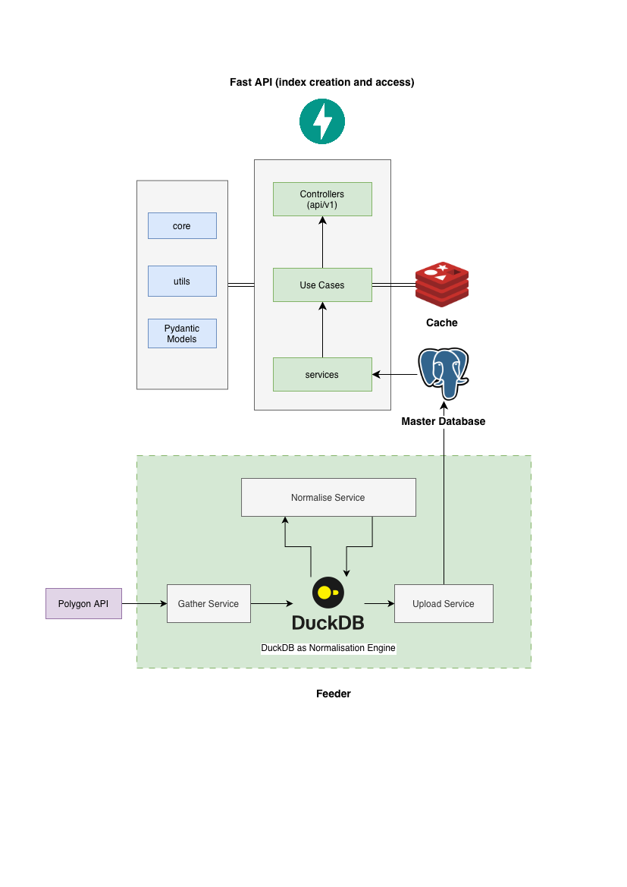

# Stock Index App
This is a backend service that tracks and manages a custom equal-weighted stock
index comprising the top 100 (configurable in env variable) US stocks by daily market capitalization.
Index is computed such a way that each stock maintains an equal notional weight and updated daily
to reflect market cap changes and rebalance composition

## How to run the Application

1) Install Poetry
2) Install Docker
3) Go to root directory of the project 
4) create .env in the root directory with the variables given below
5) create .env for feeder refer: [Feeder README](feeder/readme)
6) Run the whole application in Docker
7) If first time go to feeder directory and execute feeder with fetch from origin flag set to false

## Tech Stacks Used
* Python
* FastAPI
* Redis
* DuckDB
* Pandas
* Docker (with docker-compose)
## Components
The application have four major components
### 1) Feeder
Feeder is a standalone job which connects with https://massive.io (polygon.io in the past) APIs. More specifically, 
it connects to three endpoints given below

| Sl. No. | API Endpoint                                         | Purpose                                        |
|---------|------------------------------------------------------|------------------------------------------------|
| 1       | https://api.massive.com/v3/reference/tickers         | Fetch ticker by exchange code                  |
| 2       | https://api.massive.com/v3/reference/tickers{ticker} | Fetch market cap and company details           |
| 3       | https://api.massive.com/v1/open-close                | Fetch daily price data for each ticker by date |

This standalone job is highly configurable to asynchronously fetch data from different date ranges, exchanges, and other filters 
permitted byb the source. As the limits five API calls per minute, it recommended to use a paid subscription. The feeder uses DuckDB to store 
JSON responses received from API as it is - this is processes in done batchwise and can be configured. After gathering the data, A normalization 
query is executed in the DuckDB to create normalized tables. This normalized tables hold one-to-one mapping with the original intended data model,
but lacks referential integrity constrains and other checks. After normalization, DuckDB directly attaches to the PostgresSQL database to do the ingestion
Hence, PostgresSQL instance must be running while running Feeder. For more details refer: [Feeder README](feeder/readme.md)

### 2) PostgresSQL Database
PostgresSQL is used as the master database with a solid relational model. 
The  [Data Model Diagram](doc/datamodel/datamodel.pdf) and DBML file can be found [here](doc/datamodel) 
DB Diagram.io is used to generate the data model and schema. The business logic of the application is also within postgres as views and functions
This choice is for performance, simplicity of the API, and data quality. 

### 3) Fast API (Backend Service)
Fast API is used to build the service to interact with PostgresSQL. The API allows creation of indexes, fetching 
index performance information, also allows to export generated data into Excel. The details of the endpoints are given below

| Sl. No. | API Endpoint         | Method | Purpose/Description                                 |
|---------|----------------------|--------|-----------------------------------------------------|
| 1       | /export-data         | POST   | Export index data as Excel file                     |
| 2       | /build_index         | POST   | Build index with given parameters                   |
| 3       | /index-performance   | GET    | Get index performance data (list)                   |
| 4       | /index-composition   | GET    | Get index composition data (list)                   |
| 5       | /composition-changes | GET    | Get index composition changes (list)                |

For more details refer to the component specific documentation [Backend README](backend/readme.md)

### 4) Redis Cache
Redis Cache is used to cache the API calls to speed up the response and usage is minimal and straight forward

## Architecture

## Production And Scaling Improvements
Two work this whole Application as a system all four components need to work together
* Feeder as a daily scheduled job
* PostgresSQL, Redis, Fast API as services

Hence, the following improvements can be considered

1) As of now feeder is created to truncate the table and reload the data. This must be changed to a 
reconciliation process which inserts only the records that are not available in the database. Luckily, The design 
of the feeder application permits such enrichments of features. Hence, adding reconciliation 
will be one possible improvement. 
2) The feeder already uses a configurable loop to fetch data from API and persist into DuckDB. However, 
the normalisation will happen only after all the data persisted into DuckDB. This is a limitation. A more idea 
choice would be to do a gather, normalize, ingest into PostgresSQL loop batchwise 
3) The index data is synchronised at the table level. That means, in current setup, multiple users cannot create
and analyse indexes. Because, the data persisted for one index would override by the next index creation. 
For the purpose of the application, this is chosen intentionally to have idempotency in every operation. 
Inorder to achieve multiple indexes, each created index should have an ID and selected configurations for that Index - i.e., what is the 
ranking method, weighting method, rebalance schedule... etc. And each of these specifications must map to 
generalised PostgresSQL functions which can be assembled to form a particular Index

Apart from these, the design choices of the feeder, API directory structures, Asynchronous nature, the 
choice of handling over the normalization to DuckDB, choice of data model, the choice of handling over 
the computational complexity to PostgresSQL functions are very friendly for extending further and scalability